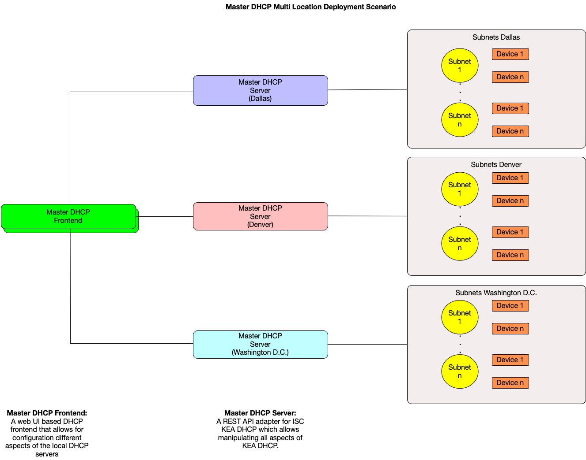

Master DHCP is a complete DHCP (Dynamic Host Configuration Protocol) system that
allows for controlling multiple geographically distributed DHCP servers using a 
web based UI. It uses ISC KEA DHCP (https://www.isc.org/kea/, 
https://gitlab.isc.org/isc-projects/kea) as the base DHCP server and adds a REST
APIlayer and a web UI to make controlling DHCP easier for systems administrators
and network engineers.

**Architecture Diagram**

**Deployment Example**

- **Features**
  - Control geographically redundant KEA DHCP servers from a single WEB UI 
  - Configure subnets, reservations, classes and other aspects of KEA DHCP
    using a web UI
  - Capture DHCP packets for troubleshooting 
 
- **Platforms**
  - Linux

- **Getting Master DHCP**
  - [Documentation](docs/documentation.md)