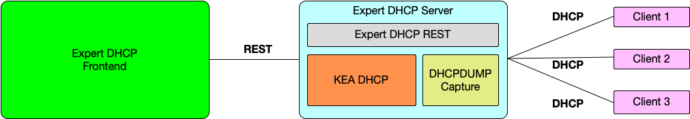

ExpertDHCP is a frontend GUI and accompanying REST service that
works in conjunction with ISC Kea DHCP (https://www.isc.org/kea/, 
https://gitlab.isc.org/isc-projects/kea).

The Expert DHCP REST service can be used to control many aspects of the Kea DHCP
server. In addition, the ExpertDHCP frontend GUI makes DHCP provisioning easy 
for administrators.

ExpertDHCP facilitates DHCP administrators to control multiple Kea DHCP servers
located in geographically different areas.

 

**Architecture Diagram**

 

**Deployment Example**

 

- **General Features**
  - Control geographically redundant Kea DHCP servers from a single WEB UI 
  - Configure subnets, reservations, classes and other aspects of Kea DHCP
    using a web UI
  - Capture DHCP packets for troubleshooting 

 

- **REST API Features**
  - Get DHCP configuration
  - Get IP from a given MAC address
  - Get reservations
  - Add reservations
  - Delete reservations
  - Add subnet
  - Delete subnet
  - Modify subnet
  - Add subnet options
  - Delete subnet options
  - Add subnet reservation options
  - Delete subnet reservation options
  - Get leases
  - Add lease
  - Update lease
  - Delete lease
  - Delete all client leases for a subnet
  - Add class
  - Delete class
  - Modify class

   

- **GUI Features**
  - Configure subnets
  - Configure leases
  - Configure client classes
  - DHCPDUMP console (future)
  - RAW REST API console

   
 
- **Platforms**
  - Linux (CentOS)
  - FreeBSD

   

- **Documentation**
  - [Documentation](docs/documentation.md)