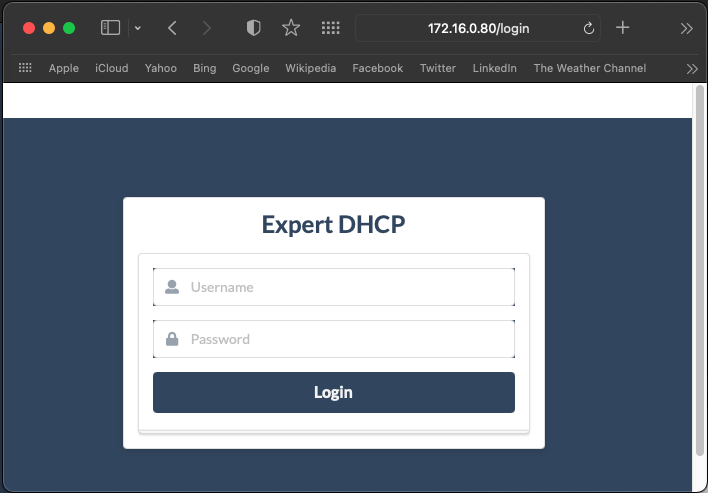
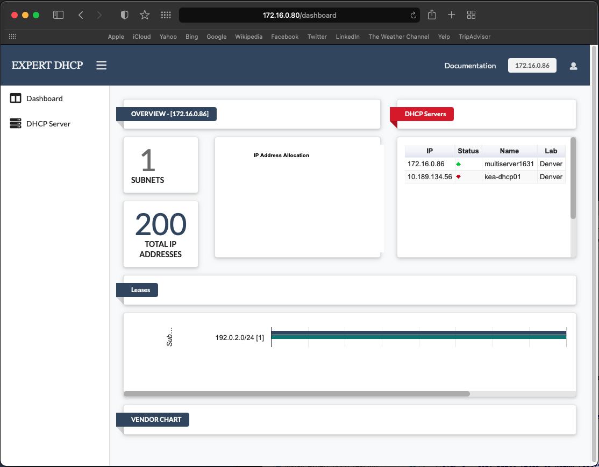

**ExpertDHCP Web UI Installation and Configuration**
-

The ExpertDHCP Web UI can be deployed in different ways. In cases where 
resources are limited, all three components, including the the Kea DHCP server,
the ExpertDHCP REST Service and the ExpertDHCP Web UI can be installed on the
same host.

In other cases, where multiple Kea DHCP servers are being controlled or where 
redundancy is needed, the ExpertDHCP Web UI can be deployed on separate physical
or virtual machines in a redundant fashion using a load balancing program such
as **KeepAlived**.

<br />

**Compatibility**

This software has been tested on CentOS and CentOS Stream Linux.

**Prerequisites**
-
  - NPM (Node Package Manager)
  - Nginx
  - git

<br />

**Installation Steps**
- 

<br />

**STEP 1 - Get ExpertDHCP Web UI**
-

The ExpertDHCP repository is located at 
https://github.com/CenturyLink/ExpertDHCP and can be cloned using the following 
command.
```console
$ cd /opt
$ git clone git@github.com:CenturyLink/ExpertDHCP.git
```

For the WebUI, the repository can be clone in the users home directory.

<br />

**STEP 2 - Install required NPM modules**
-
Change directory to **ExpertDHCP/webui/src** and execute the **npm install** 
command.
```console
$ cd ExpertDHCP/webui/
$ npm install
```

The above command will create a directory called **node_modules** and containing
NodeJS modules required by ExpertDHCP Web UI.

<br />

**STEP 3 - Create production ready build**
-

To create a ready to deploy production ready build, run the following command.
```console
$ npm run build
```

If successfully run, this command will produce a **build** directory containing
the necessary files to run the **ExpertDHCP Web UI**.

<br />

**STEP 4 - Create users.csv and apikeys.json files**
-

Create the **users.csv** file in **build/conf/**. 

The **users.csv** file is a comma separated value file containing the username,
the users' **bcrypt** encrypted passwd and a flag called "isadmin" which 
indicates whether the user is an admin or not.

An example of the **users.csv** file is given below.
```console
$ cat users.csv
user,password,isadmin
expert,$2a$12$c******Z2ArSqeVDH6eQiPxrvUMvKnSrn2gt.W5rAY9.ioIG,1
aladdin,$2a$12$zW******vS18.3dHgm.M6iTR9Ef0gtIIRbCRDwupGK,1
```

**user**: the name of the user
<br />

**password**: the Bcrypt encrypted password of the user. Passwords can be 
encrypted at **https://bcrypt-generator.com/**.
<br />

**isadmin**: this flag can be 0 which indicates that the user is not an admin, 
or a 1 which indicates that the user has admin capabilities.

Create the **apikeys.json** file in **build/conf**.

The **apikeys.json** file is a JSON file containing API keys for servers running 
ExpertDHCP REST service. This key is used to authenticate API calls made to the
ExpertDHCP REST service.

An example of the file is given below.
```json
$ cat apikeys.json
{
    "10.4.8.56": "f06299185********4c6ddc2ca"
}
```
This file should be modified to suit local needs.

NOTE: the **users.csv** and **apikeys.json** files can be modified 

<br />

**STEP 5 - Configure ExpertDHCP Web UI**
-

The **ExpertDHCP Web UI** configuration file **config.json** is located in the
**build/conf/** directory. This file should be modified to suit local needs. An
example of this file is given below. (Lines starting with "//" characters are 
comments meant to explain the function of a given parameter. They should be 
removed for deployment).
```json
{
  // Use the CSV auth file? If true, the CSV auth file is used for 
  // authentication.
  "useCsvAuthForMaster": true,

  // Default values that are chosen to be displayed on the landing page. The lab
  // and the server will reflect which lab and server will be displayed when the
  // user first loads the page.
  "defaults": { "lab": "LAB001", "server": "KEA001" },

  // Labs are different data centers. A list of labs can be defined here.
  "labs": [
    {
      
      // ID of the lab/datacenter
      "id": "LAB001",

      // Location of the lab/datacenter
      "location": "Denver",

      // Display name value of the lab/datacenter". This will be displayed on
      // the ExpertDHCp Web UI page.
      "value": "lab1",

      // A list of servers running ExpertDHCP REST service within this lab.
      "servers": [
        {
          // ID of the DHCP server
          "id": "KEA001",

          // Name of the DHCP server
          "title": "multiserver1631",

          // The IP address at this the ExpertDHCP service is available on this
          // DHCP server.
          "ip": "172.16.0.86",

          // The TCP port on which the ExpertDHCP service is available on this
          // DHCP server.
          "dhcpManagerPort": "5007",
          "dhcpMonitorPort": "5555"
        },
        {
          "id": "KEA002",
          "title": "cloud-dhcp-server-1",
          "ip": "10.4.8.56",
          "dhcpManagerPort": "5007",
          "dhcpMonitorPort": "5555"
        }
      ]
    }
  ]
}
```

The configuration should be changed as needed, based on local requirements.

Please note that the **apikeys.json** file contains the appropriate API key for 
connecting to the corresponding ExpertDHCP REST service. For example, in the
above given configuration, the **apikeys.json** file contains the API key for
server with IP 10.4.8.56.

<br />

**STEP 6 - Copy built files to Nginx root**
-

The files built above can be copied to the Nginx root directory for deployment. 
Assuming that the Nginx root directory is located at 
**/usr/share/nginx/html**, use the following command to copy them recusively.
```console
$ sudo ExpertDHCP/webui/build/* /usr/share/nginx/html/
```

<br />

**STEP 7 - Verify if the ExpertDHCP Web UI is working**
-

Navigate to the server running the ExpertDHCP Web UI. You should see a login 
page as below. 



Enter one of the user credentials given in the **users.csv** file. Upon 
successful login, the user should see the following screen.

